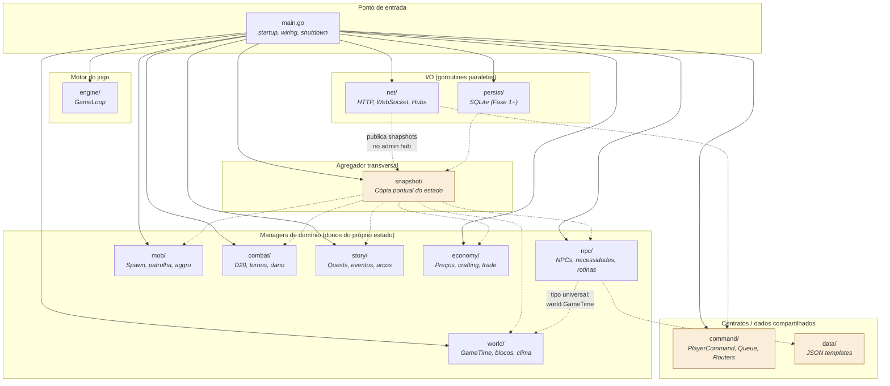

# 01 — Mapa de Dependência de Pacotes

> **Quando consultar:** Quando surgir a dúvida "onde coloco esse código?"
> ou "esse pacote pode importar aquele?"

## Diagrama



## Explicação

### Não existe god object central

Diferente de arquiteturas que centralizam tudo num `GameState` global,
aqui **cada manager é dono do próprio estado**. `world.Manager` é dono
do `GameTime`. `npc.Manager` é dono do mapa de NPCs. Quando novos
domínios entrarem (`mob/`, `combat/`, `story/`, `economy/`), cada um
vai carregar e mutar seu próprio estado.

Isso tem 3 consequências práticas:

1. **Nenhum ciclo de dependência estrutural.** Um manager novo não
   precisa ser adicionado num struct central que todo mundo importa.
2. **Encapsulamento real.** Para modificar NPCs, o código passa por
   métodos do `npc.Manager`. Não existe `gameState.NPCs[id] = nil`
   exposto pra qualquer caller.
3. **O snapshot é orquestrado, não agregado automaticamente.** O
   pacote `snapshot/` importa cada manager e monta uma cópia imutável
   a cada tick.

### O papel de cada pacote

**`main.go`** — único arquivo que importa todos os managers. Faz o
wiring completo (cria managers, hubs, routers; registra reações do tick;
inicia goroutines). Depois do startup, não participa mais da lógica de
jogo.

**`engine/`** — dono do `GameLoop` (ticker + contador + reações).
Não conhece managers diretamente — recebe uma função de reação via
`SetReactionsForTick(func())` e executa a cada tick.

**Managers de domínio (`world/`, `npc/`, `mob/`, ...)** — cada um
encapsula seu estado (map de entidades, configuração, caches) e expõe:

- `NewManager()` — constructor, faz bootstrap (load de JSON, etc.)
- `ProcessTick(...)` — avança a lógica do domínio por 1 tick
- Getters (`All()`, `Get(id)`, `GameTime()`) — consulta read-only pra
  o snapshot e para comandos admin OOB

Managers podem importar **tipos universais** de outros managers
(ex: `npc` importa `world.GameTime` pra assinatura do `ProcessTick`),
mas nunca importam comportamento. A regra é: se a dependência é só
um tipo-dado, pode; se é um método ou struct com lógica, não pode.

**`snapshot/`** — pacote agregador. Importa todos os managers e
produz uma struct `Snapshot` (cópia imutável, campos primitivos) que
pode ser serializada em JSON e enviada pro cliente admin (ou
futuramente persistida em SQLite). **Ninguém importa `snapshot/`
exceto `main.go`** e os consumidores externos de snapshot
(`net/socket/admin`, futuramente `persist`).

**`command/`** — tipos de comando do player (`PlayerCommand`,
`ClientMessage`, payloads tipados), fila thread-safe (`CommandQueue`)
e roteadores (`PlayerRouter`, `AdminRouter`). Também contém
`ProcessPlayerCommands` que roda no tick. Não importa nenhum manager
(se precisar de referência pra um manager em comando admin OOB, isso
é resolvido via **interface** definida em `command/`, implementada
pelo manager — evita acoplamento direto).

**`net/`** — HTTP server e WebSocket hubs (player + admin). Recebe
JSON, monta `PlayerCommand` via router, coloca na `CommandQueue`.
Para envio, recebe `Snapshot` via canal e serializa. Não conhece
lógica de jogo.

**`data/`** — loaders de JSON e templates estáticos. Importado pelos
managers no bootstrap (`npc.NewManager()` chama `data.LoadNpcs()`).

**`persist/`** — SQLite (vazio na Fase 0). Vai receber `Snapshot` para
persistência assíncrona.

### Fluxo de um tick

```
ticker dispara
→ engine.GameLoop acorda
→ executa a função de reação registrada pelo main:
1. commands := cmdQueue.Drain()
2. command.ProcessPlayerCommands(tickCount, commands)
3. worldManager.ProcessTick()                      # avança GameTime
4. npcManager.ProcessTick(worldManager.GameTime()) # NPCs veem tempo novo
5. snap := snapshot.Build(tickCount, worldMgr, npcMgr)
6. adminHub.Publish(snap)
```

## Regras para adicionar um pacote novo

Quando for criar um pacote, responda:

1. **Ele é um domínio de jogo com estado e tick?** → Vira manager na
   raiz (`mob/`, `combat/`, ...). Tem `NewManager()`, `ProcessTick(...)`
   e getters pro snapshot.
2. **Ele faz I/O (rede, disco, banco)?** → Vai em `net/` ou `persist/`.
   Roda em goroutine própria, comunica via channel.
3. **Ele define tipos/contratos sem estado próprio?** → Pacote na raiz
   com nome descritivo (como `command/`, `data/`). Sem `ProcessTick`.
4. **Ele precisa importar outro manager?** → Se for só pra usar um
   **tipo universal** (ex: `world.GameTime`), ok. Se for pra chamar
   métodos de comportamento, **não deveria**. Repense.
5. **Tem código pra pôr dentro agora?** → Se não, **não cria**.
   Pacote vazio é dívida.

## Regras invioláveis de dependência

A seta de import só pode apontar:

- **Para baixo**, do `main` pros pacotes (o main conhece todos)
- **De `snapshot/` para os managers** (é o agregador — essa é sua função)
- **De `net/` e `persist/` para `command/`, `snapshot/`** (I/O consome contratos)
- **De managers para tipos universais de outros managers** (ex: `npc → world.GameTime`)

Não pode:

- ❌ Manager importar comportamento de outro manager
- ❌ Qualquer manager importar `snapshot/` (ciclo)
- ❌ `command/`, `data/` importar managers (contratos não dependem de lógica)
