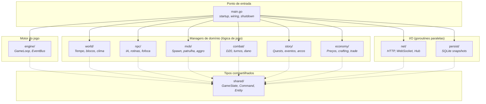

# 01 — Mapa de Dependência de Pacotes

> **Quando consultar:** Quando surgir a dúvida "onde coloco esse código?" ou "esse pacote pode importar aquele?"

## Diagrama

## Explicação

O `main.go` é o único arquivo que conhece todos os pacotes. Ele cria cada manager, injeta dependências, e passa tudo pro game loop. Nenhum outro arquivo importa tantos pacotes.

Os **managers de domínio** (world, npc, mob, combat, story, economy) nunca se importam entre si. Se o NPCManager precisa saber que horas são, ele não faz `import "world"` — ele recebe essa informação via `GameState`, um struct definido no pacote `shared/` que todos conhecem. Isso evita dependências circulares e mantém cada pacote testável isoladamente.

Os **pacotes de I/O** (net, persist) também não conhecem a lógica de jogo. O pacote `net/` sabe receber JSON e colocar um `Command` numa fila. O pacote `persist/` sabe pegar entidades dirty e gravar no SQLite. Nenhum dos dois sabe o que é um NPC, um combate, ou uma quest.

O **pacote shared/** contém os tipos que todo mundo precisa: `GameState` (o snapshot do mundo que passa entre managers), `Command` (um comando do jogador parseado), `Entity` (interface base para qualquer coisa persistível), `Event` (notificação do EventBus). Este pacote não tem lógica — só definições de tipos.

## Regras para adicionar um pacote novo

Quando for criar um pacote novo, pergunte:

1. **Ele processa lógica de jogo por tick?** → Vai na camada de managers, recebe `ProcessTick()`, é chamado pelo game loop.
2. **Ele faz I/O (rede, disco, banco)?** → Vai na camada de I/O, roda em goroutine própria, comunica via channel.
3. **Ele define tipos que outros pacotes precisam?** → Vai no `shared/`.
4. **Ele precisa importar outro manager?** → Não deveria. Repense a responsabilidade ou passe a informação via `GameState`.

## Regra de ouro

A seta de dependência só aponta para baixo (do main pro resto) e para o shared (de qualquer um pro shared). Nunca para cima (manager importando main) e nunca horizontalmente (manager importando outro manager).
