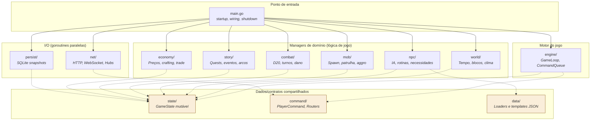

# 01 — Mapa de Dependência de Pacotes

> **Quando consultar:** Quando surgir a dúvida "onde coloco esse código?"
> ou "esse pacote pode importar aquele?"

## Diagrama

## Explicação

O `main.go` é o único arquivo que conhece todos os pacotes. Ele cria
cada manager, injeta dependências (`state.GameState`, `command.Queue`,
hubs de WebSocket), e passa tudo pro game loop.

Os **managers de domínio** (`world`, `npc`, `mob`, `combat`, `story`,
`economy`) nunca se importam entre si. Se o `npc` precisa saber que
horas são, ele lê do `state.GameState` que o `world` acabou de
atualizar no mesmo tick. Isso evita dependências circulares e mantém
cada pacote testável isoladamente.

Os **pacotes de I/O** (`net`, `persist`) não conhecem a lógica de
jogo. O `net` recebe JSON, monta `command.PlayerCommand` e empilha na
`command.Queue` (que o `engine` drena no início do tick). O `persist`
recebe entidades dirty do `state` e grava no SQLite. Nenhum dos dois
sabe o que é um NPC, um combate, ou uma quest.

Os **pacotes de dados/contratos** são importados por todos mas não
importam nenhum manager:

- **`state/`** — define `GameState`, o estado mutável central que
  carrega o snapshot do mundo de tick em tick. É o "documento" que
  passa entre managers.
- **`command/`** — define `PlayerCommand`, `ClientMessage`, payloads
  tipados, e os Routers (player/admin) que decidem o que vai pra fila
  do game loop e o que é processado out-of-band (chat).
- **`data/`** — loaders e templates estáticos lidos no startup
  (JSONs de NPCs, items, quests).

## Regras para adicionar um pacote novo

Quando for criar um pacote novo, pergunte:

1. **Ele processa lógica de jogo por tick?** → Vira manager de
   domínio na raiz (`mob/`, `combat/`, ...). Tem `New()` e
   `ProcessTick(*state.GameState)`.
2. **Ele faz I/O (rede, disco, banco)?** → Vai junto a `net/` ou
   `persist/`. Roda em goroutine própria, comunica via channel.
3. **Ele define tipos/contratos que outros pacotes precisam?** →
   Pacote dedicado na raiz (como `state/`, `command/`). Não tem
   lógica de tick, só estrutura e funções utilitárias.
4. **Ele precisa importar outro manager?** → **Não deveria.** Repense
   a responsabilidade ou passe a informação via `state.GameState`.
5. **Ele tem habitante?** → Se a resposta é "ainda não, é só pra
   organizar futuro", **não cria.** Pacote nasce quando há código pra
   pôr dentro.

## Regra de ouro

A seta de dependência só aponta:

- **Para baixo** (do `main` pro resto)
- **Para os pacotes de dados/contratos** (`state`, `command`, `data`)
  a partir de qualquer outro

Nunca **para cima** (manager importando `main`) e nunca
**horizontalmente** (manager importando outro manager).
