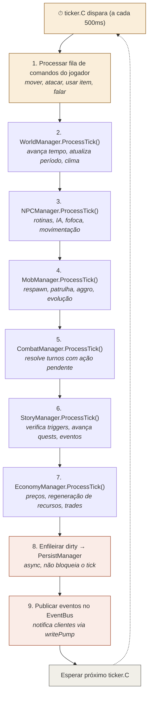

# 02 — Anatomia de Um Tick

> **Quando consultar:** Quando precisar entender a ordem de processamento, onde encaixar um manager novo, ou por que algo acontece "antes" ou "depois" de outra coisa.

## Diagrama — Sequência dentro de 1 tick

## Por que sequencial

Cada manager pode depender do estado que o anterior acabou de atualizar. Exemplos concretos:

O **WorldManager** avança o relógio e muda o período para "Noite". O **NPCManager** roda em seguida e vê que é noite — o Ferreiro guarda as ferramentas e vai dormir. Se rodassem em paralelo, o NPC poderia ver "Tarde" (estado antigo) e continuar trabalhando. Esse bug seria intermitente — às vezes funciona, às vezes não — porque a ordem de execução de goroutines paralelas é indeterminada.

O **MobManager** verifica se algum mob entrou em aggro com um jogador. O **CombatManager** roda depois e vê o combate recém-criado — pode começar a resolver o primeiro turno no mesmo tick. Se rodassem em paralelo, o CombatManager poderia não ver o combate que acabou de ser criado.

O **StoryManager** verifica se a quantidade de lobos mortos atingiu o threshold da quest. Ele precisa que o CombatManager já tenha resolvido as mortes deste tick. Se rodasse antes ou em paralelo, perderia mortes do tick atual.

## Como decidir a posição de um manager novo

Faça duas perguntas:

1. **"De qual estado atualizado eu preciso?"** → Coloque depois desse manager.
2. **"Quem precisa do estado que eu produzo?"** → Coloque antes desse manager.

Exemplo: se você criar um **WeatherManager** (clima), ele depende do WorldManager (precisa saber que período é) e o NPCManager pode depender dele (NPCs reagem ao clima). Posição: depois de World, antes de NPC.

Exemplo: se você criar um **ResourceManager** (recursos do mapa regeneram), ele depende do World (período do dia) e a Economy depende dele (quantidade de recursos afeta preço). Posição: depois de World, antes de Economy. Pode ficar junto com World inicialmente e separar quando crescer.

## Tick budget

Com tick de 500ms, todos os managers juntos têm 500ms para processar. Na prática:

- **Fases 0-3** (~100 entidades): processamento total < 5ms. Sobram 495ms ociosos.
- **Fases 4-5** (~500 entidades): processamento total ~20-50ms. Ainda confortável.
- **Se exceder 250ms**: perfil com `pprof`, otimize o manager mais lento. Só paralelizar DENTRO de um manager (dividir NPCs em batches), nunca ENTRE managers.

## O que acontece se um tick demorar mais que 500ms

O `time.Ticker` do Go descarta ticks perdidos — se o tick N demorou 600ms, o tick N+1 dispara imediatamente (sem acumular). O mundo "pula" um pouco mas não trava. Isso é aceitável e é o comportamento padrão de game loops com ticker fixo.
