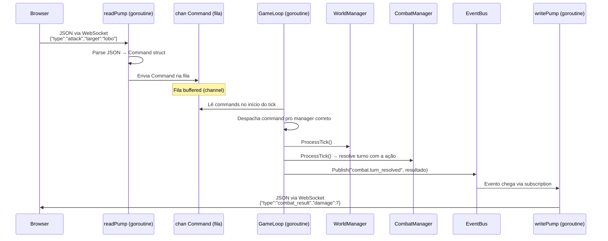
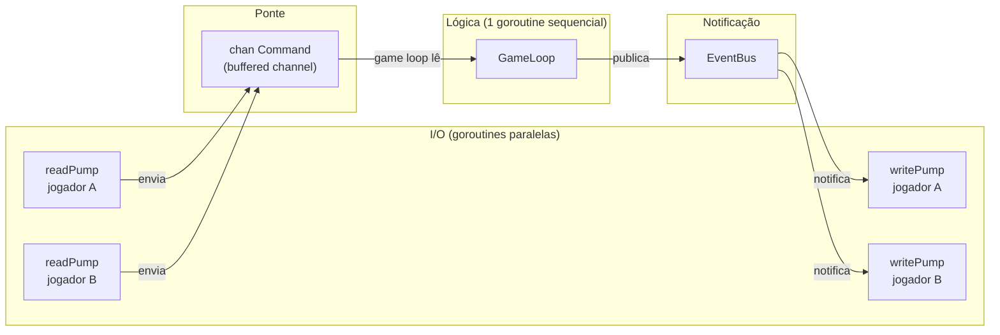

# 03 — Fluxo WebSocket → Fila → Game Loop

> **Quando consultar:** Quando for implementar o WebSocket, quando precisar entender como o comando do jogador chega até a lógica de jogo, ou quando surgir dúvida sobre "por que o game loop não lê direto do WebSocket".

## Diagrama — Visão geral



## Diagrama — Separação I/O vs Lógica



## Explicação

A arquitetura tem dois mundos separados por uma fila (channel):

**Mundo de I/O** — goroutines paralelas que lidam com rede. Cada jogador conectado gera 2 goroutines: `readPump` (lê do WebSocket) e `writePump` (escreve pro WebSocket). 10 jogadores = 20 goroutines de I/O. Elas são leves e ficam bloqueadas a maior parte do tempo esperando dados.

**Mundo da lógica** — 1 goroutine única (o game loop) que processa tudo sequencialmente. Ela nunca toca no WebSocket diretamente. Nunca faz I/O de rede. Ela só lê comandos da fila e escreve eventos no EventBus.

**A ponte entre os dois mundos** é o `chan Command` — um buffered channel. O readPump escreve nele (lado I/O). O game loop lê dele (lado lógica). É thread-safe por natureza (channels do Go são feitos para isso). Ninguém precisa de mutex.

## Por que não ler direto do WebSocket no game loop

Se o game loop lesse do WebSocket diretamente, ele precisaria gerenciar conexões, parse de JSON, timeouts, conexões quebradas — tudo dentro da goroutine que processa lógica de jogo. Qualquer erro de rede travaria o processamento do mundo inteiro.

Com a fila no meio, o readPump pode morrer (jogador desconectou) sem afetar o game loop. O game loop pode processar lento sem afetar a leitura do WebSocket. São problemas independentes tratados por goroutines independentes.

## Formato do Command

O Command é o tipo que cruza a fronteira. Definido no pacote `shared/`:

```
Command {
    Type      string    // "move", "attack", "use_item", "chat"
    PlayerID  string    // quem enviou
    Payload   map/struct // dados específicos do comando
    Timestamp time.Time // quando foi recebido
}
```

O readPump recebe JSON cru, valida o formato, cria um Command tipado, e coloca na fila. Se o JSON for inválido, o readPump responde com erro pro cliente diretamente — o game loop nunca vê comandos malformados.

## Formato dos eventos de saída

O EventBus distribui eventos tipados para os subscribers (writePumps). Cada writePump filtra os eventos relevantes para o seu jogador (baseado em localização, participação em combate, etc.) e serializa para JSON antes de enviar pro WebSocket.

```
Event {
    Topic   string      // "combat.turn_resolved", "npc.spoke", "world.period_changed"
    Data    interface{} // dados específicos do evento
    Scope   Scope       // Global, Region(blockID), Player(playerID)
}
```

O `Scope` determina quem recebe: eventos globais vão para todos, eventos de região vão para jogadores no mesmo bloco, eventos de jogador vão para um jogador específico.

## Analogia com Express (para referência mental)

| Express | Game Server |
|---------|-------------|
| HTTP request chega | JSON chega via WebSocket |
| Express route handler | readPump faz parse e switch no type |
| Controller chama service | Command vai pra fila, game loop despacha pro manager |
| Service retorna resultado | Manager atualiza estado, game loop publica evento |
| Response é enviada | writePump envia JSON pro cliente |

A diferença fundamental: no Express cada request é isolada e stateless. No game server, a conexão é persistente e o estado vive em memória entre requests. O "request" é contínuo — o cliente está sempre conectado e pode receber atualizações a qualquer momento (push), não só quando pede (pull).
