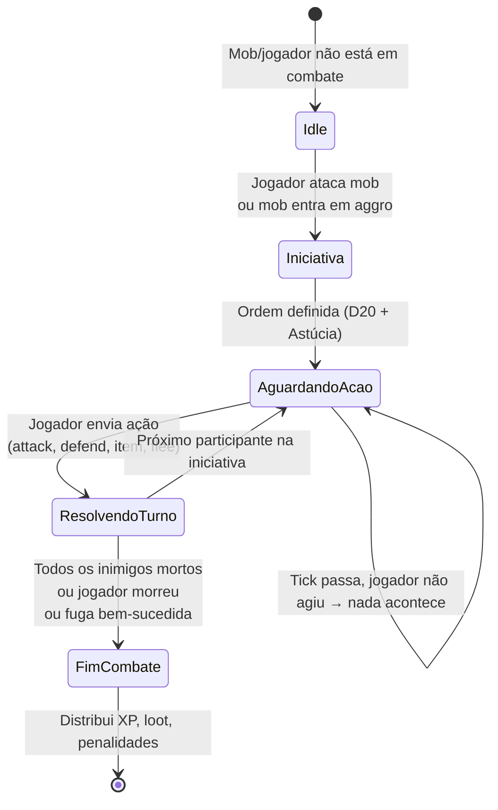
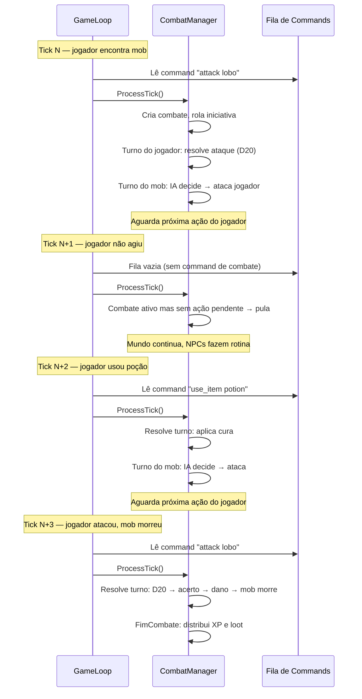

# 04 — Combate Dentro do Tick

> **Quando consultar:** Quando for implementar o CombatManager, quando surgir a dúvida "o combate roda em paralelo?", ou quando precisar entender como combate por turnos funciona num mundo em tempo real.

## Diagrama — State machine do combate



## Diagrama — Combate ao longo de vários ticks



## Explicação — Por que combate NÃO é paralelo

A intuição vinda de jogos single-player é que combate "pausa o mundo" (como Final Fantasy, Pokémon). Num MMORPG, isso é impossível — se o combate do jogador A pausasse o mundo, o jogador B ficaria congelado.

A solução é que o combate é apenas mais um estado gerenciado pelo CombatManager dentro do tick sequencial. O mundo continua rodando normalmente. O combate do jogador A avança só quando A submete uma ação. Enquanto isso, o tick processa o mundo, NPCs, outros combates de outros jogadores — tudo no mesmo fluxo sequencial.

O CombatManager mantém uma lista de combates ativos. Cada combate tem seu próprio estado (de quem é o turno, que ações foram submetidas). No `ProcessTick()`, o CombatManager itera sobre todos os combates ativos e, para cada um, verifica se há ação pendente para resolver.

## O que o CombatManager faz no ProcessTick()

A cada tick, o CombatManager segue esta lógica para cada combate ativo:

1. **Verificar se é turno de um NPC/mob**: Se sim, a IA decide a ação e resolve imediatamente (NPCs não esperam — eles agem no tick).
2. **Verificar se é turno de um jogador e ele submeteu ação**: Se sim, resolve o turno (D20, dano, efeitos) e avança a iniciativa.
3. **Verificar se é turno de um jogador e ele NÃO submeteu ação**: Não faz nada. O combate espera. Pode implementar timeout (ex: 60s sem ação = turno pulado).
4. **Verificar condição de fim**: Todos os inimigos mortos? Jogador morreu? Fuga? Se sim, encerra o combate, distribui recompensas/penalidades.

## Timeout de ação

Se um jogador não age por muito tempo, o combate trava para ele (não para o mundo). Opções de design:

- **Timeout suave**: Após 30s, o jogador recebe aviso "10 segundos restantes".
- **Timeout duro**: Após 60s, o turno é pulado (jogador perde a ação) ou uma ação default é executada (defender).
- **Sem timeout**: O combate espera indefinidamente. O mob pode fugir se a IA decidir (mob tem necessidade de sobrevivência).

Isso é decisão de game design, não de arquitetura. O CombatManager suporta qualquer uma — basta checar o timestamp da última ação do jogador.

## Múltiplos combates simultâneos

Com 10 jogadores online, pode haver 5 combates ativos ao mesmo tempo. O CombatManager processa todos eles no mesmo tick, sequencialmente:

```
CombatManager.ProcessTick():
  for _, combat := range activeCombats {
      combat.processTurn() // resolve o que puder neste tick
  }
```

Cada combate é independente. O combate do jogador A não afeta o combate do jogador B. Eles só compartilham o estado do mundo (que já foi atualizado pelo WorldManager antes do CombatManager rodar).

## Relação com o GDD

O sistema de combate D20 definido no GDD (Cap. 4) se encaixa aqui: iniciativa com D20 + Astúcia, ações por turno (atacar, defender, usar item, habilidade, fugir), crítico no 20 natural, falha no 1 natural. A diferença é que "turno" aqui não é cronometrado pelo tick — é cronometrado pela ação do jogador. O tick só é o momento em que a ação é processada.
