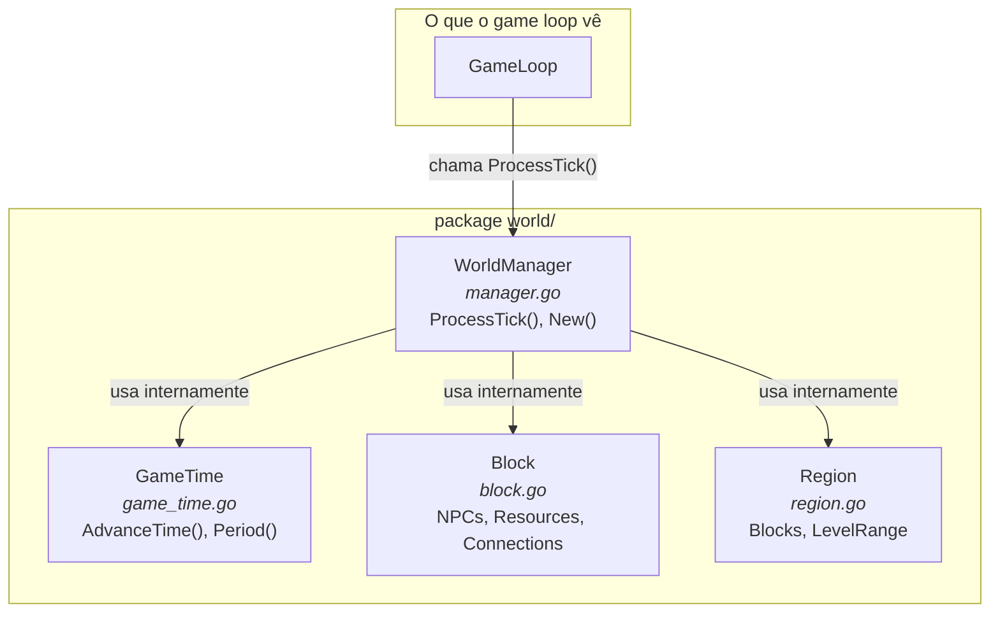
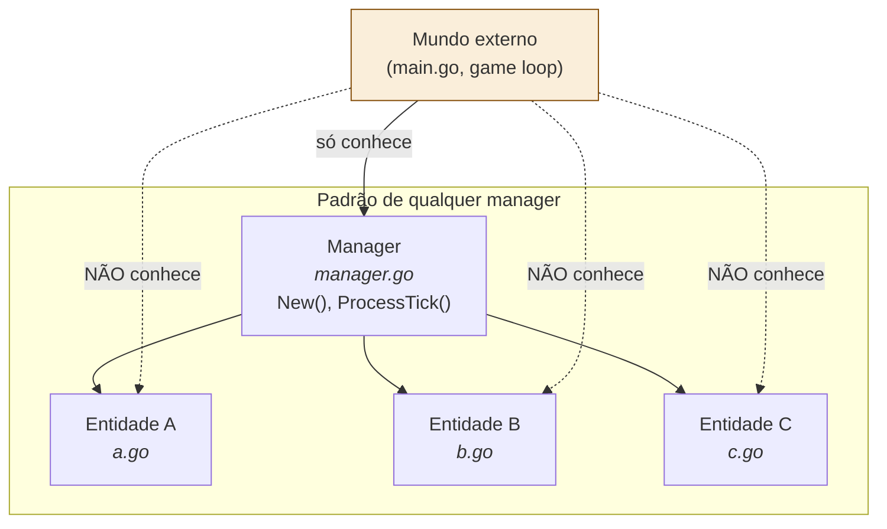

# 05 — Manager Pattern (Composição Interna de Pacote)

> **Quando consultar:** Quando criar um pacote novo, quando precisar decidir "isso vira um arquivo separado ou fica junto?", ou quando o game loop começar a conhecer detalhes internos de um pacote (sinal de que a abstração vazou).

## Diagrama — Composição do pacote world/



## Diagrama — O pattern aplicado a qualquer pacote



## Explicação — O que é o pattern

O manager é o **ponto de entrada único** do pacote. O game loop chama `manager.ProcessTick()` e o manager internamente decide o que fazer: avançar o tempo, mover NPCs, verificar respawn de mobs, resolver turnos de combate. O game loop não sabe os detalhes.

É a mesma ideia de um Service Layer em aplicação web: o Controller (game loop) chama o Service (manager), e o Service usa Repositories/Models (structs internos) por baixo. O Controller não faz queries diretas.

## Anatomia do manager.go

Cada `manager.go` segue a mesma estrutura:

```
1. Struct do Manager — contém os dados que ele gerencia
   - GameTime, lista de Blocks, mapa de NPCs por bloco, etc.

2. New() — função construtora que cria e retorna o manager
   - Recebe dependências como parâmetro (dados de configuração, channels)
   - Carrega dados iniciais (JSON templates no startup)

3. ProcessTick() — chamado pelo game loop a cada tick
   - Contém a lógica sequencial do que esse domínio faz por tick
   - Pode chamar métodos dos structs internos (gameTime.AdvanceTime)
   - Retorna eventos ou modifica o GameState que recebeu
```

## O que muda no seu código atual

Hoje, o `main.go` faz assim:

```
gameTime := world.NewGameTime()
// ...reaction function que chama gameTime.AdvanceTime()
```

O main conhece `GameTime` diretamente. Isso funciona agora, mas quando você adicionar blocos, clima, e regeneração de recursos ao pacote world, o main vai precisar manipular cada um deles. A complexidade vaza para fora do pacote.

Com o pattern, o main faria:

```
worldManager := world.NewManager(config)
// ...game loop chama worldManager.ProcessTick(gameState)
```

O main só conhece o manager. O manager cria o GameTime, os Blocks, etc. internamente. Quando você adicionar clima amanhã, só muda o `ProcessTick()` do WorldManager — o main não é alterado.

## Quando separar um arquivo dentro do pacote

Dentro de um pacote Go, todos os arquivos compartilham o namespace. A divisão em arquivos é para organização humana, não para o compilador. Regra prática:

- **1 struct principal por arquivo** — `game_time.go` tem `GameTime`, `block.go` tem `Block`
- **O manager fica em `manager.go`** — é o primeiro arquivo que alguém olha quando abre o pacote
- **Se um arquivo passa de ~200 linhas**: considere se há um struct escondido que merece seu próprio arquivo
- **Se o pacote inteiro tem menos de 100 linhas**: pode ser 1 arquivo só, sem manager formal. Comece simples

## Quando NÃO extrair um pacote

Nem toda responsabilidade precisa de seu próprio pacote. Se os recursos do mapa (ervas, minérios) são simples (regeneram por período), eles podem viver como um método dentro do `WorldManager.ProcessTick()` ou como um struct `Resource` em `world/resource.go`.

Extraia para um pacote separado (`resource/`) só quando:
- A lógica ficar complexa o suficiente para ter seu próprio `ProcessTick()`
- O pacote world estiver ficando grande demais (>500 linhas)
- A responsabilidade for claramente independente (ex: resource manager não precisa saber sobre clima)

Comece com menos pacotes e separe quando doer. O custo de mover código entre pacotes em Go é baixo (renomear imports).

## Exemplo de aplicação por pacote do jogo

| Pacote | Manager | Structs internos |
|--------|---------|-----------------|
| `world/` | WorldManager | GameTime, Block, Region |
| `npc/` | NPCManager | NPC, Agenda, KnowledgeBase, Need |
| `mob/` | MobManager | Mob, SpawnPoint, EvolutionState |
| `combat/` | CombatManager | Combat, Participant, TurnOrder |
| `story/` | StoryManager | Quest, Season, SeasonState |
| `economy/` | EconomyManager | Inventory, Recipe, TradeOffer |
