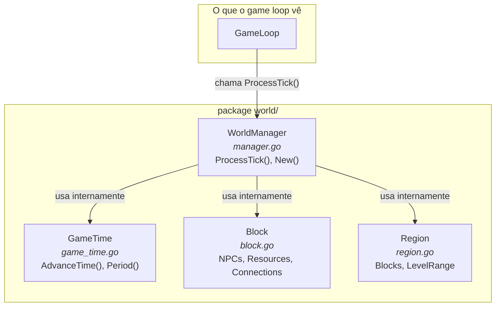
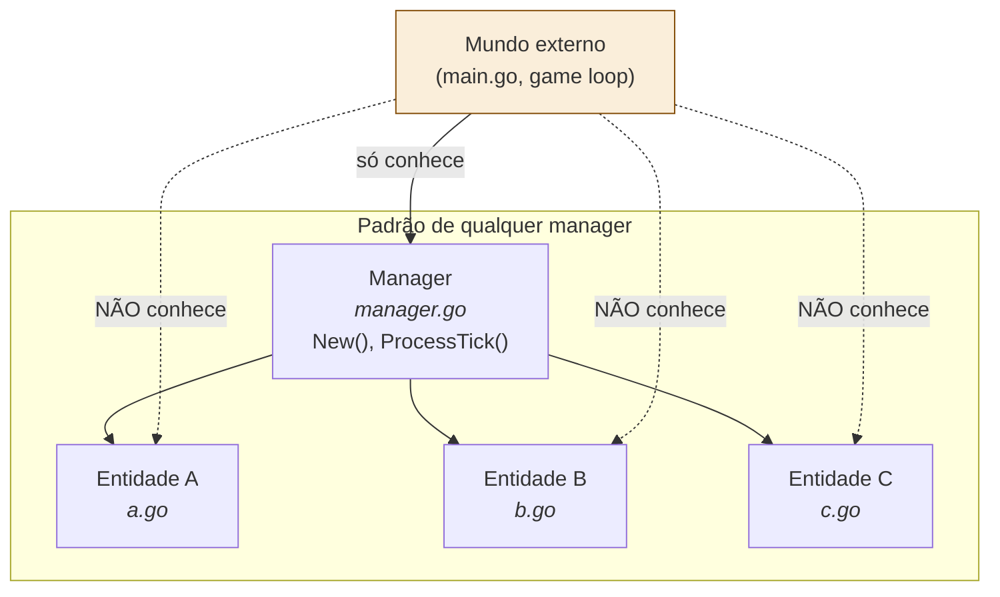

# 05 — Manager Pattern (Composição Interna de Pacote)

> **Quando consultar:** Quando criar um pacote novo, quando precisar decidir "isso vira um arquivo separado ou fica junto?", ou quando o game loop começar a conhecer detalhes internos de um pacote (sinal de que a abstração vazou).

## Diagrama — Composição do pacote world/



## Diagrama — O pattern aplicado a qualquer pacote



## Explicação — O que é o pattern

O manager é o **ponto de entrada único** do pacote. O game loop chama `manager.ProcessTick()` e o manager internamente decide o que fazer: avançar o tempo, mover NPCs, verificar respawn de mobs, resolver turnos de combate. O game loop não sabe os detalhes.

É a mesma ideia de um Service Layer em aplicação web: o Controller (game loop) chama o Service (manager), e o Service usa Repositories/Models (structs internos) por baixo. O Controller não faz queries diretas.

## Anatomia do manager.go

Cada `manager.go` segue a mesma estrutura:

```
1. Struct do Manager — é dono dos dados que ele gerencia
   - world.Manager contém o GameTime; npc.Manager contém o map de NPCs;
     mob.Manager vai conter o map de mobs, etc.
   - Estado é campo privado (minúsculo); acesso externo só via getters
     read-only (All, Get, GameTime) para snapshot e admin OOB

2. New() — função construtora que cria e retorna o manager
   - Recebe dependências como parâmetro (dados de configuração, channels)
   - Carrega dados iniciais (JSON templates no startup)

3. ProcessTick(...) — chamado pelo game loop a cada tick
   - Contém a lógica sequencial do que esse domínio faz por tick
   - Pode chamar métodos dos structs internos (gameTime.AdvanceTime)
   - Modifica o estado que o manager encapsula (não recebe GameState —
     esse padrão foi descartado no ADR-007)
   - Pode receber tipos universais de outros managers como parâmetro
     (ex: npcManager.ProcessTick(gameTime) recebe world.GameTime)
```

## Quando separar um arquivo dentro do pacote

Dentro de um pacote Go, todos os arquivos compartilham o namespace. A divisão em arquivos é para organização humana, não para o compilador. Regra prática:

- **1 struct principal por arquivo** — `game_time.go` tem `GameTime`, `block.go` tem `Block`
- **O manager fica em `manager.go`** — é o primeiro arquivo que alguém olha quando abre o pacote
- **Se um arquivo passa de ~200 linhas**: considere se há um struct escondido que merece seu próprio arquivo
- **Se o pacote inteiro tem menos de 100 linhas**: pode ser 1 arquivo só, sem manager formal. Comece simples

## Quando NÃO extrair um pacote

Nem toda responsabilidade precisa de seu próprio pacote. Se os recursos do mapa (ervas, minérios) são simples (regeneram por período), eles podem viver como um método dentro do `WorldManager.ProcessTick()` ou como um struct `Resource` em `world/resource.go`.

Extraia para um pacote separado (`resource/`) só quando:

- A lógica ficar complexa o suficiente para ter seu próprio `ProcessTick()`
- O pacote world estiver ficando grande demais (>500 linhas)
- A responsabilidade for claramente independente (ex: resource manager não precisa saber sobre clima)

Comece com menos pacotes e separe quando doer. O custo de mover código entre pacotes em Go é baixo (renomear imports).

## Exemplo de aplicação por pacote do jogo

| Pacote | Manager | Structs internos |
|--------|---------|-----------------|
| `world/` | WorldManager | GameTime, Block, Region |
| `npc/` | NPCManager | NPC, Agenda, KnowledgeBase, Need |
| `mob/` | MobManager | Mob, SpawnPoint, EvolutionState |
| `combat/` | CombatManager | Combat, Participant, TurnOrder |
| `story/` | StoryManager | Quest, Season, SeasonState |
| `economy/` | EconomyManager | Inventory, Recipe, TradeOffer |

## Getters para o Snapshot

Além de `New()` e `ProcessTick(...)`, cada manager expõe getters
read-only para o pacote `snapshot/` consumir:

```go
// world/manager.go
func (m *Manager) GameTime() GameTime { return *m.gameTime }

// npc/manager.go
func (m *Manager) All() map[string]*Npc     { return m.npcs }
func (m *Manager) Get(id string) (*Npc, bool) { ... }
```

Regras:

- **Getters retornam cópias ou ponteiros read-only** — o caller não
  deve mutar o resultado. Mutação passa pelo manager.
- **`snapshot.Build()` usa os getters** para montar a cópia imutável
  que vai pro admin hub e (futuramente) pro persist.
- **Comandos admin OOB** (ex: "detalhar NPC X") também usam os getters
  para leitura instantânea fora do tick.

Se um caller precisa mutar o estado de um manager fora do `ProcessTick`,
isso é feito via método explícito (`npcMgr.Kill(id)`, `worldMgr.SetTime(t)`).
Mutação direta por fora do manager é anti-pattern — esse é o ponto central
de ter encapsulamento por manager em vez de god object.
