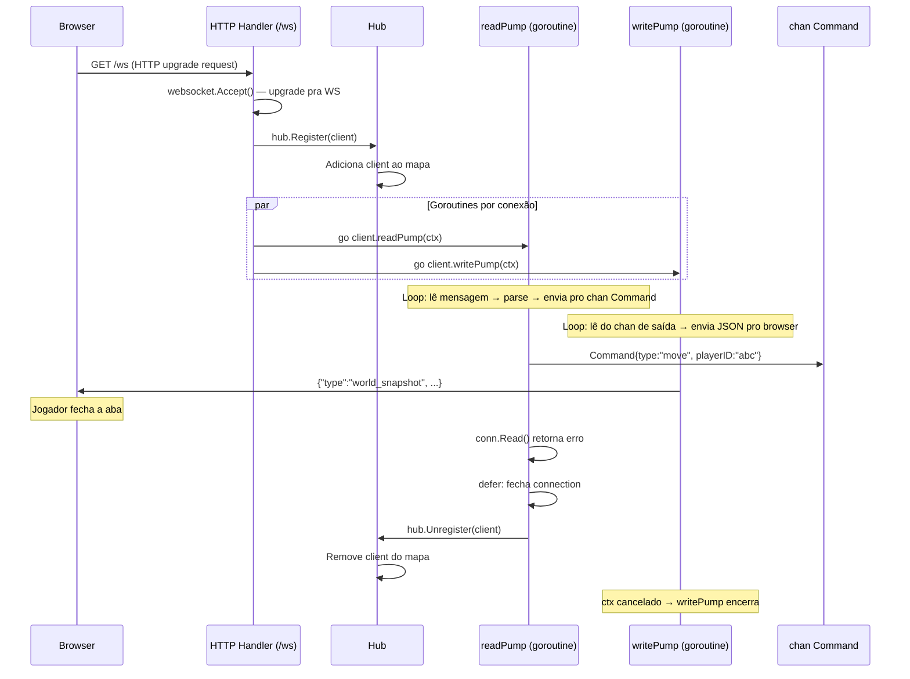
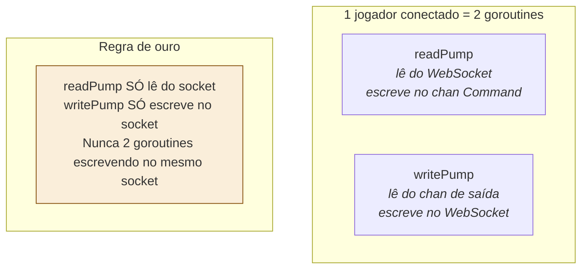

# 06 — Ciclo de Vida de uma Conexão WebSocket

> **Quando consultar:** Quando for implementar o WebSocket, quando precisar entender onde colocar `defer`, `ctx`, e goroutines na conexão, ou quando um jogador desconectar e você precisar limpar estado.

## Diagrama — Ciclo completo



## Diagrama — Goroutines ativas por conexão



## Explicação — Por que readPump e writePump separados

WebSocket em Go tem uma regra fundamental: **uma goroutine lê, outra escreve, nunca duas escrevem**. Se duas goroutines tentarem escrever no mesmo WebSocket ao mesmo tempo, os frames se misturam e a conexão corrompe.

O `readPump` fica num loop infinito chamando `conn.Read()`. Quando o jogador envia algo, `Read()` desbloqueia e retorna a mensagem. Quando o jogador desconecta, `Read()` retorna erro — é assim que você detecta desconexão.

O `writePump` fica num loop infinito esperando dados num channel de saída (`client.send`). Quando o EventBus publica algo relevante para esse jogador, o dado vai pro channel, e o writePump acorda e envia pro WebSocket. Ele também cuida do heartbeat (ping/pong).

## Onde fica o defer

```
func (c *Client) readPump(ctx context.Context) {
    defer c.conn.Close()         // ← AQUI: logo no início
    defer c.hub.Unregister(c)    // ← AQUI: logo no início (executa na ordem inversa)

    for {
        _, msg, err := c.conn.Read(ctx)
        if err != nil {
            return  // readPump termina → defers executam → conn fecha, client desregistra
        }
        // parse msg, envia pro channel...
    }
}
```

O `defer` fica logo no início da função, antes do loop. Quando o loop termina (por erro, por ctx cancelado, por qualquer motivo), os defers executam na ordem inversa: primeiro desregistra do hub, depois fecha a conexão. A ordem inversa importa: você quer que o hub saiba que o client saiu ANTES de fechar a conexão, para evitar que o hub tente enviar algo pro client que já fechou.

## Onde fica o ctx

O `ctx` vem do `main.go` (via `signal.NotifyContext`). Quando o servidor recebe SIGTERM:

1. O ctx é cancelado
2. readPump está bloqueado em `conn.Read(ctx)` — o ctx cancelado faz Read retornar erro
3. readPump termina → defer fecha conexão e desregistra
4. writePump está num `select` com `ctx.Done()` — quando ctx cancela, writePump termina

Isso garante que todas as conexões são encerradas limpa e graciosamente quando o servidor desliga.

## Heartbeat (ping/pong)

O WebSocket pode ficar "vivo" sem dados fluindo. Para detectar conexões mortas (jogador perdeu internet mas não fechou a aba), o servidor manda `ping` periodicamente e espera `pong` de volta.

```
writePump:
  ticker de ping a cada 30s
  → envia ping pro client
  → se não receber pong em 60s → fecha conexão
```

Na prática, a lib de WebSocket (`gorilla/websocket`) tem helpers pra isso: `SetPongHandler()` no readPump e `WriteMessage(PingMessage)` no writePump.

## Analogia com Express (para referência mental)

| Express | WebSocket Game Server |
|---------|----------------------|
| Request chega, handler processa, response sai. Conexão fecha. | Conexão abre, fica aberta indefinidamente. Dados fluem nos dois sentidos. |
| Cada request é isolada. Sem estado entre requests. | A conexão TEM estado: qual jogador é, onde está, se está em combate. |
| Se o handler travar, só aquele request falha. | Se a goroutine travar, aquele jogador perde a conexão. Outros jogadores não são afetados. |
| Middleware processa antes do handler. | readPump faz parse e validação antes de colocar na fila. |
