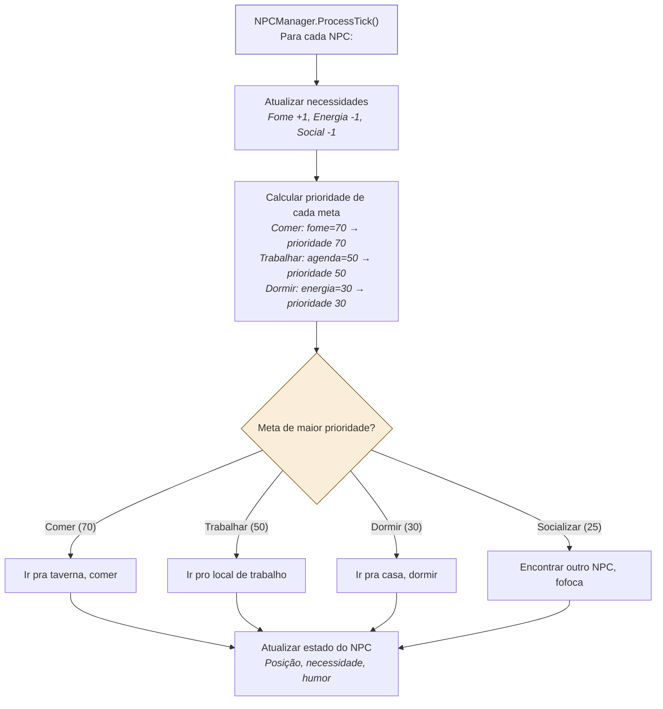
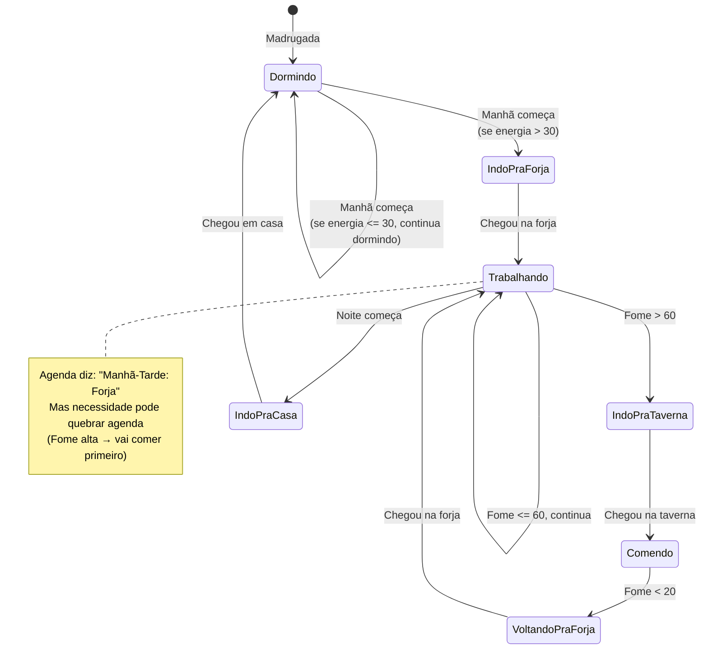
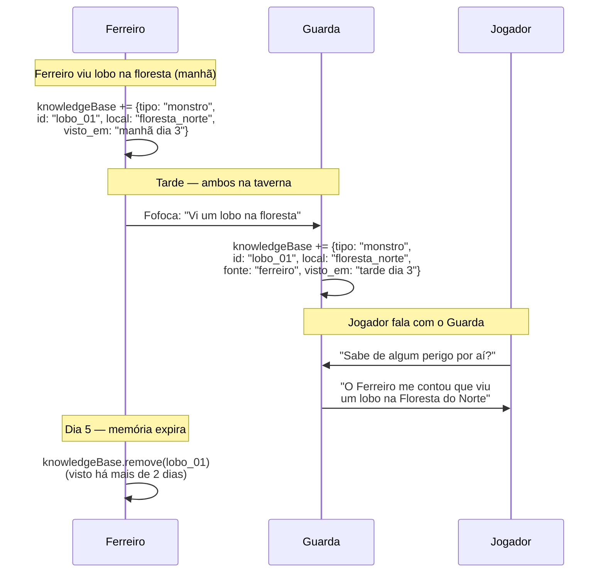

# 07 — State Machine do NPC

> **Quando consultar:** Quando for implementar o NPCManager (Fase 1), quando precisar entender como Utility AI funciona, ou quando quiser adicionar um novo comportamento a um NPC.

## Diagrama — Decisão por Utility AI

## Diagrama — Rotina diária do Ferreiro (exemplo)

## Diagrama — Sistema de fofoca

## Explicação — Utility AI vs State Machine

O NPC usa **dois sistemas combinados**:

A **Agenda** é o que o NPC "deveria" estar fazendo baseado no período do dia. O Ferreiro deveria trabalhar de Manhã a Tarde. É a rotina planejada, tipo um horário de trabalho.

As **Necessidades** são estados internos que decaem com o tempo (fome sobe, energia desce, social desce). Quando uma necessidade fica alta o suficiente, ela supera a prioridade da agenda. O Ferreiro deveria estar trabalhando, mas está com fome — ele "quebra" a rotina e vai comer.

A **Utility AI** é o mecanismo de decisão: calcula a prioridade de cada meta possível (trabalhar, comer, dormir, socializar) e escolhe a de maior prioridade. Não é um `if/else` hardcoded — é um sistema de scoring que permite comportamento emergente. Um NPC com o traço "Gula" tem peso maior pra fome, então vai comer mais cedo que outros.

## Necessidades e decaimento

Cada necessidade é um número de 0 a 100. A cada tick, as necessidades mudam:

| Necessidade | Decaimento por tick | O que sobe | O que desce |
|-------------|--------------------|-----------|-----------| 
| Fome | +1 por tick | Tempo sem comer | Comer na taverna |
| Energia | -1 por tick quando trabalhando | Dormir | Trabalhar, andar |
| Social | -0.5 por tick | Encontrar outro NPC | Ficar sozinho |
| Segurança | Variável | Estar em área perigosa | Estar em área segura |

Os valores exatos são tuning de game design — o importante é que o sistema existe e os valores são configuráveis por NPC (via traços).

## Traços do NPC

Traços são modificadores passivos que mudam como as necessidades evoluem ou como o NPC prioriza metas:

| Traço | Efeito |
|-------|--------|
| Gula | Fome cresce 50% mais rápido |
| Preguiçoso | Energia cai 50% mais rápido quando trabalhando |
| Ranzinza | Social cai mais devagar (não sente falta de companhia) |
| Valente | Segurança não afeta decisões (ignora perigo) |

## KnowledgeBase (o que o NPC sabe)

Cada NPC mantém uma base de conhecimento pessoal. Ele só sabe o que viu ou ouviu. Tipos de conhecimento:

| Tipo | Exemplo | Expira em |
|------|---------|-----------|
| Recurso | "Vi minério na mina" | 2 dias do jogo |
| Monstro | "Vi lobo na floresta" | 2 dias do jogo |
| Rotina de NPC | "O guarda vai pra taverna à noite" | 5 dias do jogo |
| Evento importante | "Jogador matou o lobo alfa" | Permanente |

O sistema de fofoca funciona quando dois NPCs se encontram no mesmo bloco: eles trocam 1-2 itens de suas knowledgeBases. Isso significa que informação se espalha organicamente pela rede social dos NPCs, sem que o jogador precise presenciar o evento diretamente.

## Para o jogador

O jogador acessa essa rede de informação conversando com NPCs. O que o NPC revela depende de:

1. **Afinidade**: o NPC gosta de você? (tabela de afinidade do Cap. 8.6)
2. **knowledgeBase**: o NPC realmente sabe o que você perguntou?
3. **Fofoca**: o NPC ouviu de outro? Nesse caso, a informação pode ser menos precisa.

## Implementação incremental

Fase 1 do projeto foca em NPC com agenda básica. A evolução:

1. **Fase 1**: NPC segue agenda fixa por período (Manhã: forja, Noite: casa). Sem necessidades.
2. **Fase 1 avançada**: Adiciona necessidades (fome, energia). NPC pode quebrar agenda.
3. **Fase 2**: Adiciona knowledgeBase. NPC acumula informação sobre o que vê.
4. **Fase 2 avançada**: Adiciona fofoca. NPCs trocam informação ao se encontrar.
5. **Fase 4**: Jogador pode conversar com NPC e acessar a knowledgeBase.
