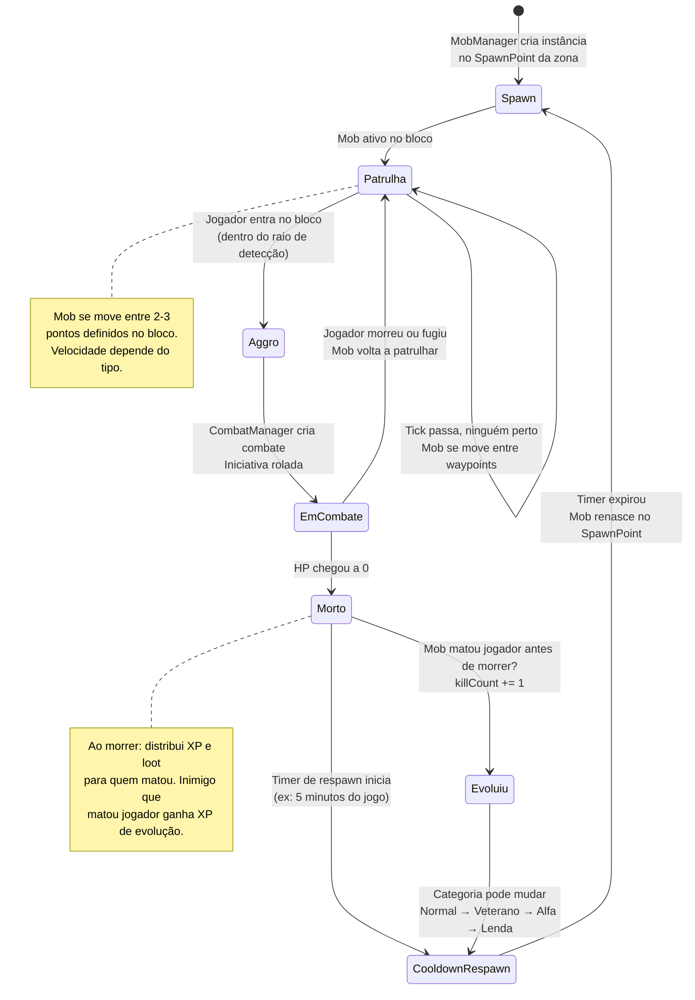
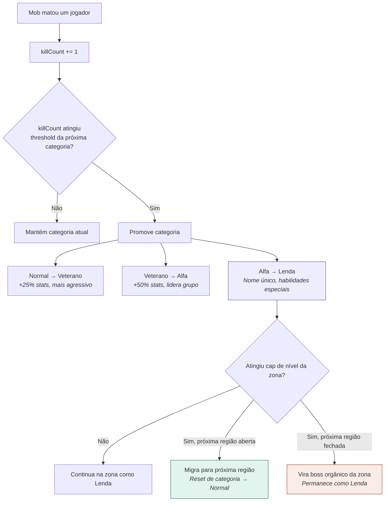
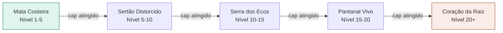

# 08 — Ciclo de Vida do Mob

> **Quando consultar:** Quando for implementar o MobManager, quando precisar entender respawn, aggro, evolução de inimigos, ou migração entre zonas.

## Diagrama — Ciclo completo de um mob



## Diagrama — Sistema de evolução por kills



## Diagrama — Migração entre regiões



## Explicação — O que o MobManager faz

O MobManager é dono de todos os mobs vivos no mundo. Ele mantém uma lista de mobs e seus estados. No `ProcessTick()`, ele faz (em ordem):

1. **Verificar respawns pendentes**: Se algum mob morto tem o timer de respawn expirado, cria uma nova instância no SpawnPoint original.
2. **Processar patrulha**: Mobs em estado "Patrulha" se movem entre waypoints. Nada complexo — é mover a posição entre 2-3 pontos pré-definidos no bloco.
3. **Verificar aggro**: Para cada mob em patrulha, verificar se há algum jogador no mesmo bloco (ou dentro do raio de detecção). Se sim, mudar estado para "Aggro".
4. **Iniciar combate**: Mobs em estado "Aggro" que ainda não estão em combate → o MobManager pede pro CombatManager criar um combate.
5. **Verificar evolução**: Mobs que mataram jogadores podem ter evolução pendente (killCount atingiu threshold) → promove categoria.
6. **Verificar migração**: Mobs que atingiram o cap de nível da zona → verifica se a próxima região está aberta.

O CombatManager resolve o combate. O MobManager cuida do antes (spawn, patrulha, aggro) e do depois (morte, respawn, evolução).

## SpawnPoint

Cada zona tem uma lista de SpawnPoints definidos em JSON:

```
SpawnPoint {
    ID          string
    BlockID     string    // em qual bloco spawna
    MobTemplate string    // qual tipo de mob ("lobo", "jacare")
    MaxAlive    int       // máximo de instâncias vivas ao mesmo tempo
    RespawnTime Duration  // quanto tempo após morrer para respawnar
    Waypoints   []Point   // pontos de patrulha dentro do bloco
}
```

O template do mob (stats base, loot table, comportamento) vem do JSON de dados estáticos. A instância (HP atual, posição, killCount, categoria) vive em RAM e é gerenciada pelo MobManager.

## Timer de respawn

Quando um mob morre, o MobManager registra o timestamp da morte. A cada tick, verifica se `(agora - timestampMorte) > respawnTime`. Se sim, cria nova instância. Simples assim — não precisa de timer goroutine ou scheduler separado.

## Cap de população

Cada zona tem um limite máximo de mobs. O MobManager verifica antes de respawnar: se o número de mobs vivos na zona já atingiu o cap, o respawn é adiado até que uma vaga abra (outro mob morreu ou migrou).

## Rate limiting de evolução

Para evitar que um jogador morra repetidamente pro mesmo mob pra "farmá-lo" (fazendo o mob evoluir até Lenda pra pegar loot melhor), o mob só ganha XP de evolução de um kill a cada N minutos. Se o mesmo jogador morrer pro mesmo mob 5 vezes em 10 minutos, conta como 1 kill.

## Implementação incremental

A evolução do MobManager ao longo das fases:

1. **Fase 1**: Mobs spawnam num bloco e ficam parados. Sem aggro, sem patrulha.
2. **Fase 2**: Mobs patrulham entre waypoints. Aggro quando jogador entra no bloco.
3. **Fase 3**: Mobs entram em combate (CombatManager resolve). Morte e respawn.
4. **Fase 4**: Evolução por kills. Normal → Veterano → Alfa → Lenda.
5. **Fase 6**: Migração entre zonas/regiões.
