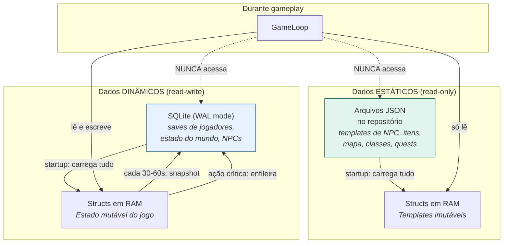
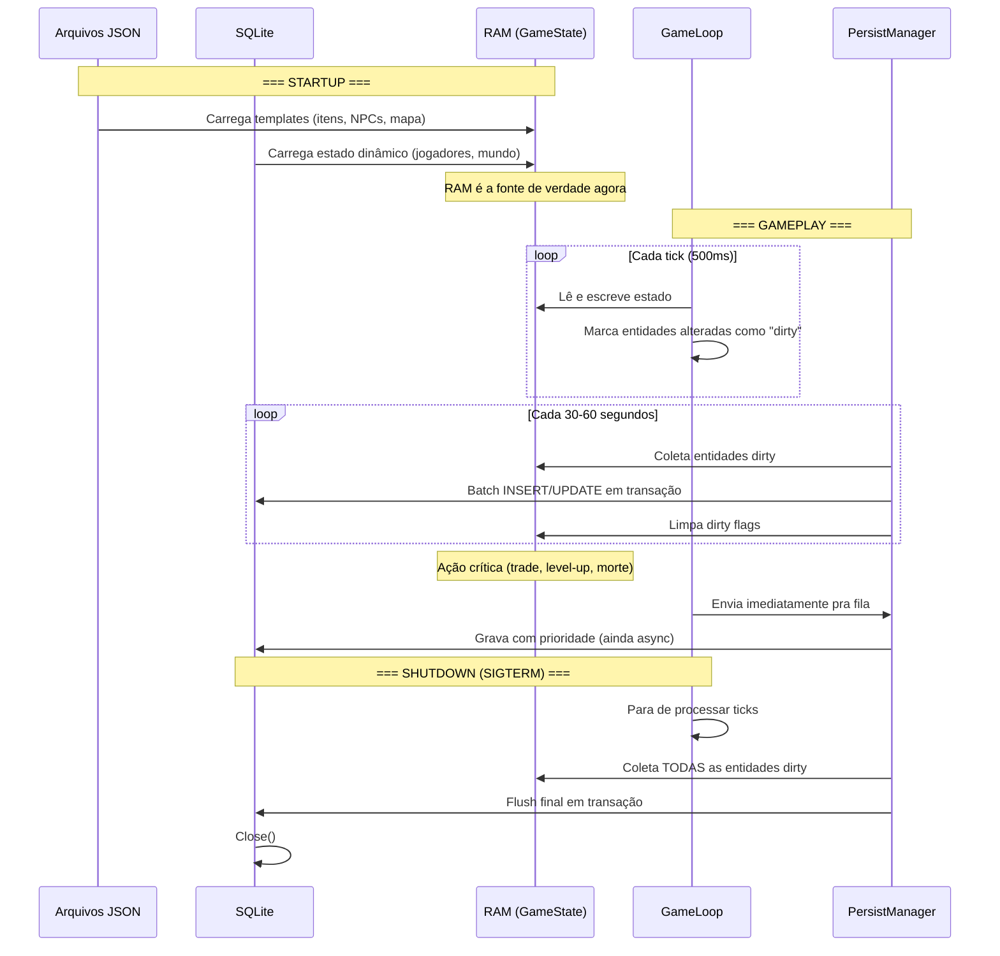

# 09 — Fluxo de Dados: Estáticos vs Dinâmicos

> **Quando consultar:** Quando precisar decidir "isso vai em JSON, em RAM, ou no SQLite?", quando for implementar o PersistManager, ou quando quiser entender como os dados fluem do startup ao gameplay ao shutdown.

## Diagrama — Os dois tipos de dados



## Diagrama — Fluxo temporal: startup → gameplay → shutdown



## Explicação — Por que RAM-first

Um game server processa ticks a cada 500ms com centenas de entidades. Se cada tick fizesse queries ao banco, a latência do disco (mesmo SSD: ~0.1ms por query × centenas de queries = dezenas de ms) comeria o tick budget. Numa web app isso é aceitável porque cada request é independente. Num game loop, é inaceitável porque tudo precisa ser resolvido em <500ms.

A solução é que toda a leitura e escrita durante gameplay acontece na RAM. O banco de dados é um checkpoint — ele existe para que, se o servidor cair, o mundo não se perca. Mas durante gameplay, ele não é consultado.

## O que é estático vs dinâmico

| Dado | Estático ou dinâmico? | Onde mora | Exemplo |
|------|----------------------|-----------|---------|
| Template de item | Estático | JSON → RAM | "Espada de Ferro: dano 1d6, tipo corte" |
| Instância de item (no inventário) | Dinâmico | RAM → SQLite | "Espada de Ferro do Kaira: durabilidade 8/12" |
| Template de NPC | Estático | JSON → RAM | "Ferreiro Tomás: agenda, traços, diálogos base" |
| Estado do NPC | Dinâmico | RAM → SQLite | "Ferreiro Tomás: fome 45, posição forja, knowledgeBase [...]" |
| Mapa de blocos | Estático | JSON → RAM | "Floresta do Norte: conexões, tipo terreno, SpawnPoints" |
| Estado do bloco | Dinâmico | RAM → SQLite | "Floresta do Norte: recursos restantes, mobs presentes" |
| Classe do personagem | Estático | JSON → RAM | "Guerreiro Tribal: PV base 14, habilidades [...]" |
| Personagem do jogador | Dinâmico | RAM → SQLite | "Kaira: HP 32/40, XP 340, posição vila, inventário [...]" |
| Receita de crafting | Estático | JSON → RAM | "Machadinha de Obsidiana: requer 2 obsidiana + 1 madeira" |
| Preço atual no mercado | Dinâmico | RAM → SQLite | "Obsidiana: 50 UC (subiu por escassez)" |

A regra: se o dado **nunca muda durante gameplay**, é estático (JSON, versionado no git). Se o dado **muda durante gameplay**, é dinâmico (RAM durante jogo, SQLite para persistir).

## PersistManager — como funciona

O PersistManager roda em sua própria goroutine, separada do game loop. Ele tem um buffered channel por onde recebe entidades dirty.

O fluxo:

1. O game loop modifica uma entidade (ex: jogador moveu de bloco)
2. O game loop marca a entidade como dirty (flag booleana no struct)
3. A cada 30-60 segundos, o PersistManager varre as entidades dirty
4. Coleta todas numa lista, abre uma transação SQLite, faz batch INSERT/UPDATE
5. Fecha a transação, limpa as dirty flags

Para ações críticas (trade entre jogadores, morte, level-up), o game loop envia a entidade direto pro channel do PersistManager com prioridade alta. A escrita continua sendo async (não bloqueia o tick), mas entra na fila antes do snapshot periódico.

## Schema do SQLite

O schema é simples e flexível. Campos que precisam de query SQL (ex: em qual bloco o jogador está) ficam em colunas dedicadas. Dados complexos (inventário, stats) ficam em colunas JSON.

```sql
CREATE TABLE players (
    id TEXT PRIMARY KEY,
    name TEXT NOT NULL,
    block_id TEXT NOT NULL,
    data JSON NOT NULL,      -- inventário, stats, tudo mais
    updated_at INTEGER NOT NULL
);

CREATE TABLE world_state (
    key TEXT PRIMARY KEY,     -- "game_time", "season", "economy"
    data JSON NOT NULL,
    updated_at INTEGER NOT NULL
);

CREATE TABLE npcs (
    id TEXT PRIMARY KEY,
    block_id TEXT NOT NULL,
    data JSON NOT NULL,      -- necessidades, knowledgeBase, humor
    updated_at INTEGER NOT NULL
);
```

A vantagem de JSON nas colunas: quando você adicionar um campo novo ao NPC (ex: "medo"), não precisa de migration no banco. A struct Go já tem o campo, o JSON serializa automaticamente. O banco se adapta ao código, não o contrário.

## Risco: crash sem graceful shutdown

Se o servidor travar (panic não recuperado, kill -9, queda de energia), os dados do último intervalo de snapshot (30-60 segundos) são perdidos. Mitigação:

1. Intervalo curto de snapshot (30s)
2. Ações críticas entram na fila imediatamente
3. `recover()` no game loop para capturar panics e fazer flush antes de morrer
4. Em produção: VPS com UPS ou monitoring que reinicia rápido
