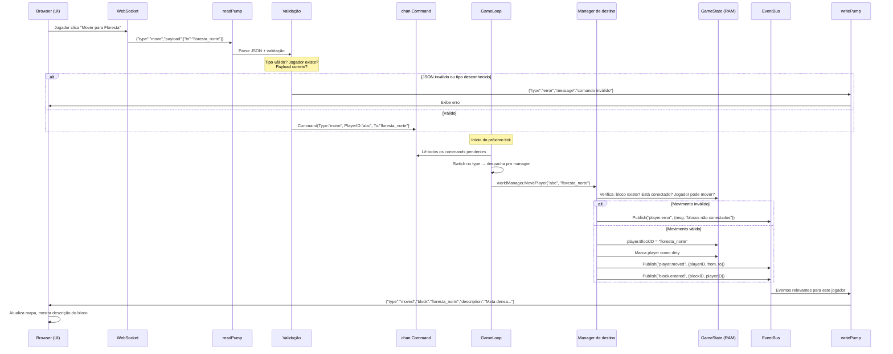
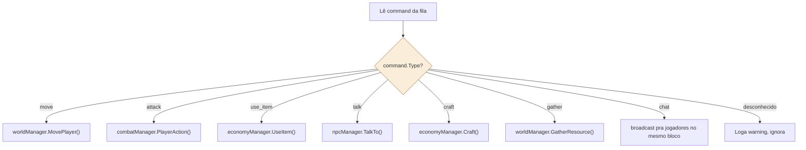

# 10 — Jornada Completa de um Comando do Jogador

> **Quando consultar:** Quando for conectar o primeiro comando funcional (Fase 0-2), quando quiser rastrear onde um comando "se perde", ou quando precisar entender a cadeia completa de processamento.

## Diagrama — Jornada completa: clique → resposta na tela



## Diagrama — Switch de despacho no game loop



## Explicação — A cadeia de responsabilidade

Cada etapa da cadeia tem uma responsabilidade única e clara:

**Browser** — serializa a intenção do jogador em JSON e envia. Não faz validação de lógica de jogo (servidor autoritário = cliente é "burro").

**readPump** — recebe bytes do WebSocket, faz parse do JSON, valida o formato básico (tem campo `type`? é string? payload é objeto?). Se inválido, responde com erro diretamente — o game loop nunca vê lixo. Se válido, cria um `Command` tipado e coloca na fila.

**Fila (chan Command)** — desacopla I/O do game loop. É buffered (capacidade de ~100-1000 commands) para absorver picos de atividade. Se encher (spam), readPump pode dropar o command e notificar o jogador de rate limiting.

**Game loop** — no início de cada tick, drena a fila completamente (processa todos os commands que chegaram desde o último tick). Faz switch no `Type` e despacha pro manager correto. O game loop não conhece a lógica de negócio — ele só roteia.

**Manager** — recebe o comando, valida contra o estado do jogo (o jogador pode mover? está em combate? o bloco existe? está conectado?), aplica a mudança no GameState, e publica eventos relevantes.

**EventBus** — distribui eventos para subscribers. O writePump do jogador afetado recebe o evento e serializa a resposta JSON.

**writePump** — envia o JSON pro browser. O browser atualiza a UI.

## Formato do protocolo cliente↔servidor

Tudo é JSON com `type` + `payload`. Exemplos de ida (cliente → servidor):

```json
{"type": "move", "payload": {"to": "floresta_norte"}}
{"type": "attack", "payload": {"target": "lobo_01"}}
{"type": "use_item", "payload": {"item": "potion_hp", "target": "self"}}
{"type": "talk", "payload": {"npc": "ferreiro_tomas"}}
{"type": "gather", "payload": {"resource": "madeira_ferro"}}
{"type": "craft", "payload": {"recipe": "machadinha_obsidiana"}}
```

Exemplos de volta (servidor → cliente):

```json
{"type": "moved", "block": "floresta_norte", "description": "Mata densa...", "npcs": [...], "mobs": [...]}
{"type": "combat_started", "enemies": [...], "initiative": [...]}
{"type": "combat_turn", "attacker": "you", "target": "lobo", "roll": 18, "damage": 7}
{"type": "item_gathered", "item": "madeira_ferro", "quality": "media", "proficiency_xp": 1}
{"type": "error", "message": "Blocos não estão conectados"}
{"type": "world_snapshot", "time": "15:04", "period": "Tarde", "block": {...}}
```

O `world_snapshot` é enviado a cada tick para todos os jogadores conectados, mantendo a UI atualizada com o estado do mundo.

## Latência percebida

O jogador clica → a ação vai pro servidor → o servidor processa no próximo tick → a resposta volta. A latência máxima é: latência de rede (ida) + tempo até o próximo tick (max 500ms) + tempo de processamento (<5ms) + latência de rede (volta). Total: ~50ms a ~600ms dependendo de quando o comando chegou no ciclo do tick.

Para um jogo por turnos com interface web, isso é imperceptível. Em jogos de ação em tempo real seria um problema — mas esse não é o caso.
