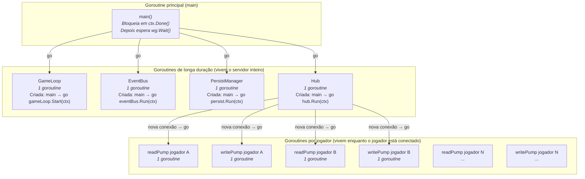
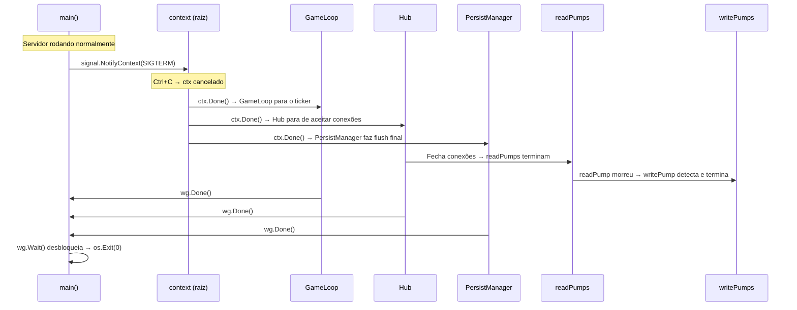

# 11 — Mapa de Goroutines Ativas

> **Quando consultar:** Quando quiser ter certeza de que não está perdendo goroutines (leak), quando precisar entender quantas goroutines existem ao mesmo tempo, ou quando uma goroutine não estiver terminando no shutdown.

## Diagrama — Todas as goroutines em runtime



## Contagem de goroutines

Com N jogadores conectados, o servidor tem exatamente:

| Goroutine | Quantidade | Quem cria | Quem mata |
|-----------|-----------|-----------|-----------|
| main | 1 | runtime | SIGTERM → retorna |
| GameLoop | 1 | main | ctx cancelado |
| EventBus | 1 | main | ctx cancelado |
| PersistManager | 1 | main | ctx cancelado |
| Hub | 1 | main | ctx cancelado |
| readPump | N (1 por jogador) | Hub (na conexão) | Erro de leitura ou ctx cancelado |
| writePump | N (1 por jogador) | Hub (na conexão) | ctx cancelado ou readPump morreu |

**Total: 5 + 2N goroutines.**

Com 10 jogadores: 25 goroutines. Com 100 jogadores: 205 goroutines. Goroutines em Go são leves (~8KB de stack cada), então 205 goroutines consomem ~1.6MB. Irrelevante.

## Diagrama — Ciclo de vida e cancelamento



## Explicação — Como evitar goroutine leak

Goroutine leak é quando uma goroutine fica rodando pra sempre sem ninguém ouvindo, consumindo memória e CPU. As causas mais comuns:

**Causa 1: Canal sem leitor.** Se uma goroutine escreve num channel e ninguém lê, ela bloqueia pra sempre. Solução: channels buffered ou `select` com `default` ou `ctx.Done()`.

**Causa 2: Loop infinito sem condição de saída.** Se o readPump tem `for { conn.Read() }` sem checar o ctx, e o WebSocket nunca retorna erro, a goroutine nunca termina. Solução: passar ctx para `conn.Read(ctx)` — quando ctx cancela, Read retorna erro.

**Causa 3: defer que nunca executa.** Se uma goroutine entra num loop antes do defer ser registrado. Solução: defer logo no início da função, antes de qualquer loop.

**Regra prática:** Toda goroutine de longa duração deve ter uma das seguintes condições de saída no seu loop:
- `case <-ctx.Done():` no select
- Erro retornado por uma operação bloqueante (Read, Write)
- Channel fechado que o `range` detecta

## Monitorando goroutines

Em desenvolvimento, adicione ao endpoint `/admin/status`:

```json
{
  "goroutines": 25,
  "players_online": 10,
  "tick_count": 14832,
  "last_tick_duration_ms": 3
}
```

O valor de `runtime.NumGoroutine()` do Go retorna o total. Se esse número só cresce e nunca diminui (mesmo quando jogadores desconectam), há um leak.

## Quando a goroutine certa é NENHUMA

Nem tudo precisa de goroutine. Regras:

- **Lógica de jogo (managers)**: NÃO usa goroutine. Roda sequencialmente dentro do tick do game loop.
- **I/O de longa duração (WebSocket, persistência)**: USA goroutine. Fica bloqueada esperando I/O a maior parte do tempo.
- **Cálculo curto dentro do tick (rolar D20, mover NPC)**: NÃO usa goroutine. É rápido o suficiente pra rodar no tick.
- **Cálculo pesado que excede tick budget (futuro: pathfinding de 500 NPCs)**: USA goroutine worker pool DENTRO do manager, não fora dele.
