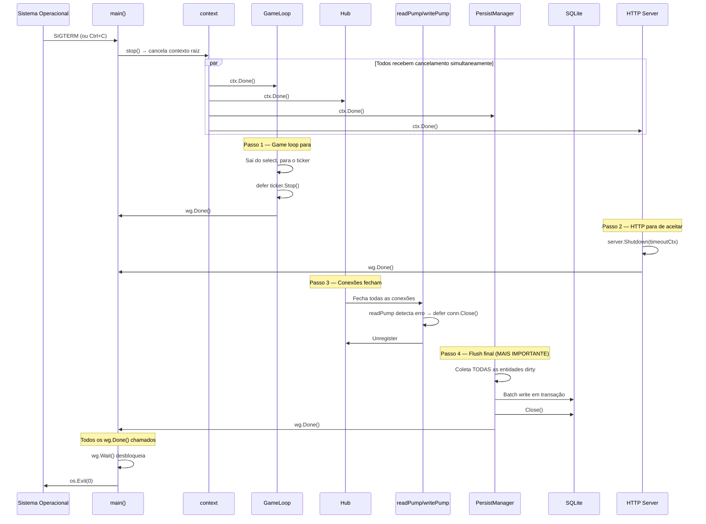
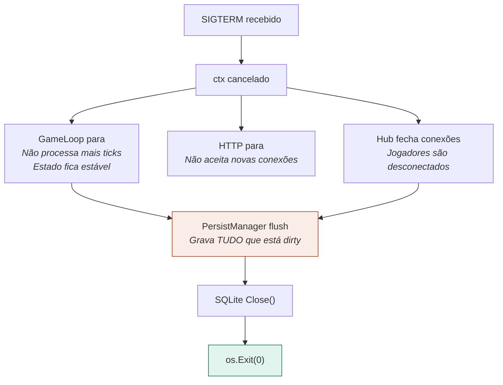

# 12 — Graceful Shutdown

> **Quando consultar:** Quando precisar garantir que o servidor desliga sem perder dados, quando for adicionar um novo componente que precisa de cleanup, ou quando o shutdown estiver travando (wg.Wait() nunca retorna).

## Diagrama — Sequência de desligamento

## Diagrama — Ordem importa

## Explicação — Por que o flush é o passo mais importante

Se o servidor desligar sem flush, todo o estado alterado desde o último snapshot (até 60 segundos de gameplay) é perdido. Jogadores perdem itens, XP, posição. Isso é inaceitável mesmo em desenvolvimento.

A sequência correta é:
1. Game loop para primeiro (estado para de mudar)
2. Conexões fecham (ninguém envia mais comandos)
3. PersistManager faz flush com o estado final estável
4. Banco fecha
5. Processo termina

Se o PersistManager fizer flush antes do game loop parar, ele pode pegar um estado inconsistente (metade de um tick processado). Se o banco fechar antes do flush, o flush falha silenciosamente.

## Como implementar com WaitGroup

O `sync.WaitGroup` é o mecanismo que garante que o main espera todos os componentes terminarem antes de sair. Cada componente que precisa de cleanup chama `wg.Add(1)` antes de iniciar e `wg.Done()` quando terminar. O `main()` chama `wg.Wait()` que bloqueia até todos os `Done()` serem chamados.

O seu código atual já faz isso corretamente para o game loop e o HTTP server. Quando adicionar PersistManager e Hub, eles entram no mesmo pattern.

## Timeout de shutdown

Se algum componente travar e nunca chamar `wg.Done()`, o servidor fica preso em `wg.Wait()` pra sempre. Solução: adicionar timeout ao shutdown.

Lógica: se `wg.Wait()` não completar em 10 segundos, force a saída com `os.Exit(1)`. Isso é melhor que ficar travado — pelo menos o SO recicla o processo.

## O que seu código atual já faz certo

O `main.go` já implementa corretamente:
- `signal.NotifyContext` para capturar SIGTERM/SIGINT
- `sync.WaitGroup` para coordenar shutdown
- `<-ctx.Done()` no main para bloquear
- O game loop respeita ctx e para o ticker com defer
- O HTTP server faz `Shutdown()` com timeout

O que falta quando crescer:
- PersistManager precisa entrar no WaitGroup e fazer flush no shutdown
- Hub precisa fechar conexões ativamente (não só parar de aceitar)
- O flush do PersistManager precisa acontecer DEPOIS que o game loop parou

## Checklist para adicionar novo componente ao shutdown

Quando criar um novo componente de longa duração (goroutine):

1. Ele recebe `ctx context.Context` e `wg *sync.WaitGroup` como parâmetro
2. No início: `wg.Add(1)` e `defer wg.Done()`
3. Ele respeita `ctx.Done()` no seu loop (select ou verificação)
4. Se precisa de cleanup (fechar arquivo, flush dados), o cleanup roda DEPOIS de `ctx.Done()` e ANTES de `wg.Done()`
5. O main chama `wg.Wait()` que espera esse componente terminar
