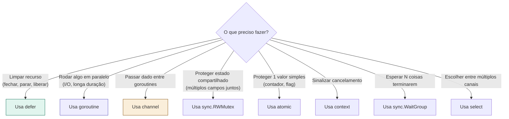

# 13 — Patterns de Go Aplicados ao Game Server

> **Quando consultar:** Quando surgir dúvida sobre "quando uso defer?", "quando crio goroutine?", "quando uso channel vs mutex?", ou qualquer dúvida de Go aplicada ao contexto do projeto. Este é o documento mais consultado durante o desenvolvimento.

## Resumo rápido de decisão



---

## 1. defer — Limpeza garantida

### Quando usar

Sempre que adquirir um recurso que precisa ser devolvido. O defer garante a devolução mesmo que a função termine por erro, panic, ou return antecipado.

### Regra

A linha do defer fica imediatamente após a linha que adquire o recurso. Nunca depois de um loop, nunca no fim da função.

### Exemplos no projeto

```
Criou ticker → defer ticker.Stop()
Abriu conexão → defer conn.Close()
Adquiriu lock → defer mutex.Unlock()
Registrou no hub → defer hub.Unregister(client)
Adicionou no WaitGroup → defer wg.Done()
```

### Ordem de execução

Defers executam na ordem inversa do registro (LIFO — Last In, First Out). Se você registrar:

```
defer A()
defer B()
defer C()
```

A execução será: C → B → A. Isso importa quando a ordem de cleanup faz diferença (ex: desregistrar do hub ANTES de fechar a conexão).

### Armadilha comum

Defer dentro de loop. Se você tem `for { conn := openConnection(); defer conn.Close() }`, os defers se acumulam e só executam quando a FUNÇÃO terminar, não quando a iteração terminar. Isso causa leak. Solução: extraia o corpo do loop pra uma função separada.

### Quando NÃO usar

Para operações que não envolvem recurso adquirido. Não faz sentido `defer fmt.Println("fim")` — isso é só cosmético e confunde quem lê.

---

## 2. goroutine — Paralelismo para I/O

### Quando criar goroutine

Somente quando algo precisa rodar em paralelo porque bloquearia quem chamou. No projeto:

| Goroutine | Por que precisa de goroutine |
|-----------|------------------------------|
| GameLoop | Roda loop infinito com ticker — bloquearia o main |
| readPump | Fica bloqueada em conn.Read() — uma por jogador |
| writePump | Fica bloqueada esperando dados pra enviar |
| PersistManager | Fica bloqueada esperando entidades dirty |
| Hub | Fica bloqueada no select de register/unregister/broadcast |
| EventBus | Fica bloqueada distribuindo eventos |

### Quando NÃO criar goroutine

Para lógica de jogo dentro do tick. Os managers (World, NPC, Mob, Combat) rodam sequencialmente na goroutine do GameLoop. Criar goroutine pra cada manager introduziria race conditions sem nenhum benefício de performance (o processamento é rápido).

Regra prática: se a operação termina em menos de 1ms, ela não precisa de goroutine. Goroutine é para operações que bloqueiam indefinidamente (leitura de socket, escrita em disco, espera em channel).

### Como iniciar uma goroutine corretamente

Toda goroutine de longa duração segue este padrão:

```
1. Recebe ctx e wg como parâmetros
2. defer wg.Done() logo no início
3. Loop com select que inclui ctx.Done()
4. Cleanup (se necessário) antes do return
```

---

## 3. channel — Comunicação entre goroutines

### O que é

Channel é o pipe tipado do Go. Uma goroutine escreve, outra lê. É thread-safe por design — não precisa de lock.

### Quando usar

Quando uma goroutine precisa enviar dados para outra. No projeto:

| Channel | Quem escreve | Quem lê | O que transporta |
|---------|-------------|---------|-----------------|
| commandQueue | readPumps | GameLoop | Commands dos jogadores |
| client.send | EventBus/Hub | writePump | Eventos para enviar ao browser |
| hub.register | HTTP handler | Hub | Novo client para registrar |
| hub.unregister | readPump | Hub | Client para remover |
| persistQueue | GameLoop | PersistManager | Entidades dirty para gravar |

### Buffered vs Unbuffered

**Unbuffered** (`make(chan T)`): O escritor bloqueia até o leitor estar pronto. Útil quando você quer sincronização (ambos param e trocam no mesmo instante).

**Buffered** (`make(chan T, 100)`): O escritor pode escrever até encher o buffer sem bloquear. Útil quando escritor e leitor trabalham em ritmos diferentes.

No projeto, quase todos os channels são buffered: o readPump escreve commands a qualquer momento, e o game loop só lê no início do tick. O buffer absorve o intervalo.

### Armadilha: escrever em channel cheio

Se o channel buffered estiver cheio e você tentar escrever, a goroutine bloqueia. Se ninguém ler, ela fica travada pra sempre (leak). Solução: `select` com `default` ou `ctx.Done()`:

```
select {
case ch <- command:
    // enviou com sucesso
case <-ctx.Done():
    // servidor está desligando, descarta
default:
    // channel cheio, descarta ou notifica rate limit
}
```

### Armadilha: ler de channel fechado

Se um channel for fechado com `close(ch)`, quem lê recebe o zero value do tipo imediatamente (sem bloquear). Use `range ch` para iterar até o channel fechar, ou `val, ok := <-ch` para checar se foi fechamento.

---

## 4. select — Multiplexação de channels

### O que é

Select é o `switch` para channels. Bloqueia até que um dos cases esteja pronto e executa aquele case. Se mais de um estiver pronto, escolhe um aleatoriamente.

### Padrão no projeto: loop + select

Toda goroutine de longa duração usa este padrão:

```
for {
    select {
    case <-ctx.Done():
        // hora de parar — faz cleanup e retorna
        return
    case cmd := <-commandQueue:
        // recebeu um comando — processa
    case <-ticker.C:
        // tick disparou — executa lógica periódica
    }
}
```

### Por que ctx.Done() está em todo select

Para que a goroutine saiba quando parar. Sem esse case, a goroutine ficaria presa no select mesmo após o servidor receber SIGTERM. O ctx é o sinal universal de "hora de ir embora".

### Padrão: select com timeout

Para operações que não devem bloquear pra sempre:

```
select {
case result := <-ch:
    // recebeu resultado
case <-time.After(5 * time.Second):
    // timeout — o resultado não chegou a tempo
case <-ctx.Done():
    // servidor desligando
}
```

---

## 5. context — Cancelamento em cascata

### O que é

Context é um valor que carrega deadline, cancelamento e metadados entre goroutines. Quando o context raiz é cancelado, todos os contexts filhos são cancelados automaticamente. É assim que o SIGTERM chega a todas as goroutines.

### Padrão no projeto

```
main()
  ctx raiz ← signal.NotifyContext(SIGTERM, SIGINT)
    ├── go gameLoop.Start(ctx)        ← recebe ctx
    ├── go hub.Run(ctx)               ← recebe ctx
    ├── go persist.Run(ctx)           ← recebe ctx
    └── HTTP handler
          └── go readPump(ctx)        ← recebe ctx
          └── go writePump(ctx)       ← recebe ctx
```

Quando o SO envia SIGTERM, `ctx` é cancelado. Isso cascata para TODAS as goroutines que receberam esse ctx. Cada uma detecta via `<-ctx.Done()` no select e termina.

### Quando criar context filho

Quando uma operação precisa de timeout independente do ctx raiz. Exemplo: o shutdown do HTTP server tem seu próprio timeout de 5 segundos:

```
shutdownCtx, cancel := context.WithTimeout(context.Background(), 5*time.Second)
defer cancel()
server.Shutdown(shutdownCtx)
```

Note que usa `context.Background()` como pai, não o ctx raiz — porque o ctx raiz já foi cancelado (é por isso que estamos no shutdown). O timeout é independente.

### Regra

Toda goroutine de longa duração recebe ctx como primeiro parâmetro. Funções curtas que não bloqueiam não precisam de ctx.

---

## 6. sync.RWMutex — Proteger estado compartilhado

### Quando usar

Quando múltiplas goroutines precisam ler e escrever os mesmos dados. No projeto, o caso principal é o GameState quando o game loop escreve e as writePumps leem.

Mas no design atual, as writePumps recebem dados via EventBus (channel), não lendo o GameState diretamente. Então o mutex é menos necessário do que parece. Channels são a forma preferida de comunicação no Go.

### Quando usar mutex vs channel

| Situação | Usar |
|----------|------|
| Passar dados de A para B | Channel |
| Múltiplos leitores simultâneos + 1 escritor | RWMutex |
| Proteger mapa compartilhado (ex: mapa de clients no Hub) | Mutex OU goroutine dona do mapa (com channel de acesso) |

O Hub no seu projeto usa o pattern "goroutine dona do mapa": o mapa de clients só é acessado dentro do Hub.Run(), que é uma goroutine só. Outros acessam via channels (register, unregister). Isso elimina a necessidade de mutex.

---

## 7. atomic — Para valores simples

### Quando usar

Para um valor numérico ou booleano que precisa ser lido/escrito por múltiplas goroutines sem lock. Mais leve que mutex, mas só funciona para 1 valor independente.

### Exemplos no projeto

```
running atomic.Bool     → GameLoop está rodando?
tickCount atomic.Int64  → Quantos ticks já passaram?
online atomic.Int64     → Quantos jogadores conectados?
```

Esses valores são lidos pelo endpoint `/admin/status` (goroutine do HTTP) e escritos pelo game loop ou hub (outras goroutines). Atomic garante que a leitura nunca pega um valor "meio escrito".

### Quando NÃO usar

Quando múltiplos valores precisam mudar atomicamente juntos (ex: posição X e Y de um NPC). Se você atualizar X com atomic e Y com atomic separadamente, outra goroutine pode ler X novo com Y antigo — inconsistência. Nesse caso, use mutex.

---

## 8. sync.WaitGroup — Esperar N coisas terminarem

### Quando usar

No shutdown. O main precisa esperar que game loop, hub, persist, e HTTP server terminem antes de sair. WaitGroup conta quantos "estou trabalhando" existem e bloqueia em Wait() até todos chamarem Done().

### Padrão

```
var wg sync.WaitGroup

wg.Add(1)
go func() {
    defer wg.Done()
    // trabalho de longa duração
}()

wg.Wait() // bloqueia até Done() ser chamado
```

### Armadilha

`wg.Add(1)` precisa ser chamado ANTES de iniciar a goroutine, não dentro dela. Se chamar dentro, existe uma race condition onde `wg.Wait()` pode executar antes do `wg.Add(1)`.

---

## Tabela de decisão resumida

| Preciso de... | Uso | Exemplo no projeto |
|---------------|-----|-------------------|
| Limpar recurso ao sair da função | `defer` | `defer ticker.Stop()` |
| Rodar algo em paralelo | `go func()` | `go gameLoop.Start(ctx)` |
| Enviar dado entre goroutines | `chan` | `commandQueue <- cmd` |
| Escolher entre múltiplos canais | `select` | Game loop: ticker vs ctx |
| Sinalizar "hora de parar" | `context` | `<-ctx.Done()` |
| Proteger mapa compartilhado | `Mutex` ou goroutine dona | Hub com mapa de clients |
| Ler/escrever 1 valor simples entre goroutines | `atomic` | `tickCount.Add(1)` |
| Esperar tudo terminar no shutdown | `WaitGroup` | `wg.Wait()` no main |

---

## Erros comuns do projeto e como evitar

| Erro | Consequência | Prevenção |
|------|-------------|-----------|
| Escrever no WebSocket por 2 goroutines | Frames corrompidos, crash | readPump só lê, writePump só escreve |
| Esquecer defer ticker.Stop() | Timer roda pra sempre | defer logo após NewTicker |
| Channel cheio sem fallback | Goroutine trava pra sempre | select com default ou ctx.Done() |
| Ler GameState fora do game loop sem proteção | Race condition | Comunicar via channel/EventBus |
| wg.Add(1) dentro da goroutine | Race com wg.Wait() | wg.Add(1) antes do go |
| Context não passado para goroutine | Goroutine não para no shutdown | Toda goroutine longa recebe ctx |
